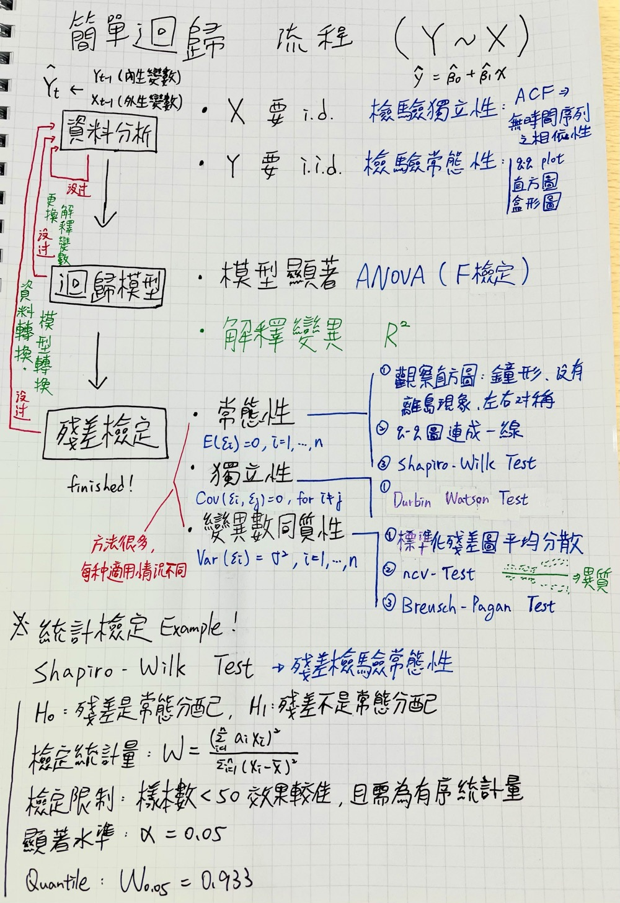

# 台積電ADR(TSM)，是否為台灣護國神山的領先指標？

```
課程名稱：東吳大學 財精系選修課－迴歸分析
時間：2021 Spring
指導老師：蕭維政 助理教授

團隊成員：
1. 江祐宏
2. 陳亮妘
3. 蔡其浩
```
### 緒論
> 全球金融市場牽一髮而動全身，資訊與資訊之間，往往互相影響。若是要了解股價間波動的原因，似乎能夠從一些資訊中看出端倪。了解這些訊息，從中套利成了投資人的參考依據。本次研究以台灣台積電股價報酬率作為解釋變數，台積電 ADR 作為反應變數進行簡單迴歸分析，研究結果顯示台積電 ADR 對台積電股票報酬率的影響有顯著性。


### 實作流程

1. 資料蒐集
2. 探索性資料分析
3. 簡單迴歸分析
4. 殘差檢定
5. 去除離群值
6. 再建模型


### 結論
最終模型 y = 0.0005 + 0.3485x
> 在此次研究中，我們使用簡單迴歸這個統計方法來探討台積電與台積電 ADR 報酬率的關係。最終結果顯示，台積電 ADR 報酬率確實與其母公司股價報酬率有相當程度的影響。然而透過 R-squared 顯示變數的解釋能力差，代表其並非影響母股報酬率最重要的因素。因此，假如未來再聽到相關議題時，可不必過度反應，媒體人所說「有影響」確實為真，但我們不用依據此單一因素而全然改變了原本的決策。


### 完成作品：
1. [結論簡報](https://docs.google.com/presentation/d/1-PuX-PhRuA_fpbkmHxMwq7XdjgAcatWn8nIDYwPS3IE/edit?usp=sharing)
2. [書面資料]()


---

### 最後，附上透過這次報告學到的重點心得


